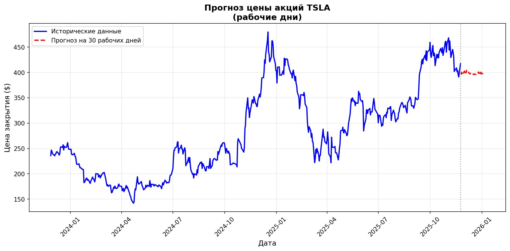

# 🤖 Телеграм-бот для анализа и прогнозирования акций на основе временных рядов

[](https://www.python.org/)
[](https://core.telegram.org/bots/api)
[]()
[]()

**Учебный проект по курсу "Временные ряды"** - Telegram-бот для анализа акций с использованием машинного обучения

## 📋 Оглавление
- [🎯 О проекте](#-о-проекте)
- [🚀 Возможности](#-возможности)
- [⚙️ Установка и запуск](#️-установка-и-запуск)
- [📊 Использование](#-использование)
- [🤖 Модели машинного обучения](#-модели-машинного-обучения)
- [🏗️ Архитектура проекта](#️-архитектура-проекта)
- [📈 Выходные данные](#-выходные-данные)
- [📝 Логирование](#-логирование)
- [⚠️ Важное предупреждение](#️-важное-предупреждение)
- [📚 Дополнительная информация](#-дополнительная-информация)

## 🎯 О проекте

Этот проект представляет собой **Telegram-бота для анализа и прогнозирования цен акций**, разработанный в рамках учебного курса по временным рядам.

**Цель проекта:** Создать интеллектуальную систему, которая:
1. Автоматически загружает исторические данные акций
2. Обучает несколько моделей машинного обучения
3. Выбирает лучшую модель для прогнозирования
4. Строит прогноз на 30 рабочих дней
5. Генерирует торговые рекомендации
6. Рассчитывает потенциальную прибыль

## 🚀 Возможности

### ✅ Основные функции
- **Загрузка данных** с Yahoo Finance за последние 2 года
- **Автоматическое обучение** трёх различных моделей
- **Интеллектуальный выбор** лучшей модели по метрике MAPE
- **Прогнозирование** на 30 рабочих дней
- **Визуализация** результатов
- **Генерация рекомендаций** (покупка/продажа)
- **Расчёт прибыли** для указанной суммы инвестиций

### ✅ Дополнительные функции
- 📱 Удобный интерфейс Telegram
- ⏱️ Работа в реальном времени (1-2 минуты на анализ)
- 🛡️ Обработка ошибок и валидация ввода
- 📝 Подробное логирование всех операций
- 🔄 Поддержка популярных тикеров (AAPL, TSLA, GOOGL и др.)

## ⚙️ Установка и запуск

### Требования
- Python 3.8 или выше
- Установленный pip
- Токен Telegram бота (получается у @BotFather)

### Шаг 1: Клонирование и настройка
```bash
# Клонируйте репозиторий
git clone <url-репозитория>
cd stock-analysis-bot

# Установите зависимости
pip install -r requirements.txt
```
### Шаг 2: Настройка Telegram бота

Откройте @BotFather в Telegram

Создайте нового бота командой `/newbot`

Получите API токен

Замените строку в файле `Project_chat_bot.py`:
```
API_TOKEN = 'Укажите ваш токен'  # → Ваш токен
```

### Шаг 3: Запуск бота
```bash
python Project_chat_bot.py
```

📊 Использование

Доступные команды

| Команда | Описание | Пример |
|---------|----------|---------|
| `/start` | Начало работы и справка | `/start` |
| `/help` | Помощь по командам | `/help` |
| `/choose` | Анализ акций | `/choose AAPL 10000` |
| `/test` | Проверка данных | `/test TSLA` |
| `/exit` | Выход из бота | `/exit` |

### Формат команды анализа

`/choose ТИКЕР СУММА`

**ТИКЕР** - код акции на бирже (например: AAPL, TSLA, MSFT)

**СУММА** - сумма для условной инвестиции в долларах

### Пример работы

```
Пользователь: /choose AAPL 5000

Бот: 🔄 Анализирую AAPL с инвестицией $5,000.00...
     ⏳ Это займет 1-2 минуты...

[Через 1-2 минуты]
Бот отправляет:
1. 📈 График с прогнозом на 30 дней
2. 📊 Инвестиционную сводку
3. 💡 Рекомендации по торговле
4. 💰 Расчёт потенциальной прибыли
```

# 🤖 Модели машинного обучения

## 🎯 Обоснование выбора моделей

В проекте реализованы **три различных подхода** к прогнозированию временных рядов:

### 1. **Random Forest (Классическая ML модель)**

**Почему выбрана:**

- **Устойчивость к шуму** - финансовые данные содержат много случайных колебаний
- **Интерпретируемость** - можно анализировать важность лаговых признаков
- **Быстрое обучение** - оптимально для работы в реальном времени
- **Нет переобучения** - благодаря механизму бэггинга

**Реализация:**

- 15 лаговых признаков (lag features)
- 50 деревьев, максимальная глубина 10
- Метрики: RMSE и MAPE

### 2. **ARIMA (Статистическая модель)**

**Почему выбрана:**

- **Теоретическая обоснованность** - классический метод для анализа временных рядов
- **Автоматическое учёт тренда** - параметр d=1 обеспечивает стационарность
- **Проверенная эффективность** - золотой стандарт в финансовой аналитике
- **Интерпретируемость параметров** - p, d, q имеют чёткий статистический смысл

**Реализация:**

- Порядок (2,1,2) - оптимальный для финансовых данных
- Автоматический fallback на (1,1,1) при ошибках
- Устойчивая работа с разными типами временных рядов

### 3. **LSTM (Нейросетевая модель)**

**Почему выбрана:**

- **Долгосрочные зависимости** - способность запоминать паттерны на длинных промежутках
- **Автоматическое извлечение признаков** - не требует ручного feature engineering
- **Нелинейные зависимости** - улавливает сложные рыночные паттерны
- **State-of-the-art** - современный подход с лучшими результатами

**Реализация:**

- Архитектура: LSTM(50) → Dense(25) → Dense(1)
- Окно в 30 дней для обучения
- MinMaxScaler для нормализации данных
- 10 эпох обучения для баланса скорости и качества

## 🔍 Критерий выбора лучшей модели

```python
# Выбираем модель с минимальной MAPE
best_model_name = min(valid_models, key=lambda x: valid_models[x]['mape'])
```
MAPE (Mean Absolute Percentage Error) - средняя абсолютная процентная ошибка:

Наиболее интерпретируемая метрика для финансовых прогнозов

Показывает среднюю ошибку в процентах

Позволяет сравнивать модели на разных масштабах данных

## 🏗️ Архитектура проекта

**Структура кода**

```
Project_chat_bot.py
├── Настройка логирования
├── Функции работы с данными
│   ├── load_data() - загрузка с Yahoo Finance
│   ├── prepare_train_test_data() - разделение данных
│   └── create_lagged_features() - создание признаков
├── Модели машинного обучения
│   ├── train_random_forest() - Random Forest
│   ├── train_arima() - ARIMA
│   └── train_lstm() - LSTM
├── Выбор лучшей модели
│   └── select_best_model()
├── Прогнозирование
│   └── make_forecast()
├── Визуализация
│   └── create_plot()
├── Генерация рекомендаций
│   └── generate_trading_recommendations()
└── Обработчики команд Telegram
    ├── handle_choose()
    ├── handle_start()
    ├── handle_test()
    └── handle_exit()
```

**Поток данных**

1. Ввод пользователя → Telegram команда `/choose`

2. Валидация → проверка формата и значений

3. Загрузка данных → Yahoo Finance API

4. Подготовка данных → разделение на train/test

5. Обучение моделей → параллельное обучение трёх моделей

6. Выбор лучшей → сравнение по MAPE

7. Прогнозирование → 30 рабочих дней

8. Анализ прогноза → поиск минимумов/максимумов

9. Расчёт прибыли → симуляция торговой стратегии

10. Визуализация → построение графика

11. Отправка результатов → пользователю в Telegram

### 📈 Выходные данные

1. График прогноза
   


Синяя линия - исторические данные

Красная пунктирная линия - прогноз на 30 дней

Вертикальная серая линия - граница между историей и прогнозом

Подписи осей - дата и цена закрытия

2. Инвестиционная сводка
```
📊 ИНВЕСТИЦИОННАЯ СВОДКА

💰 Начальные инвестиции: $5,000.00
🏦 Финальный капитал: $5,625.50
📈 Прибыль: $625.50 (+12.51%)

🎯 Рекомендации:
• Дни для покупки: ['День 5', 'День 12', 'День 19']
• Дни для продажи: ['День 8', 'День 15', 'День 22']

📅 Период прогноза: 30 рабочих дней
```

3. Детали сделок (если были)
   
```
💼 Детали сделок:
2025-11-15: КУПИТЬ 10 акций по $125.50
2025-11-22: ПРОДАТЬ 10 акций по $135.75
```

### 📝 Логирование

**Формат логов**

```
2025-11-15 14:30:25 - UserID: 12345, Ticker: AAPL, Investment: 5000.0
2025-11-15 14:32:10 - UserID: 12345, BestModel: LSTM, MAPE: 0.0452, Profit: 625.50
```

## Сохраняемая информация

- ID пользователя в Telegram

- Дата и время запроса

- Тикер анализируемой компании

- Сумма инвестиции

- Выбранная модель (Random Forest/ARIMA/LSTM)

- Значение MAPE (метрика качества)

- Рассчитанная прибыль

## 📝 Логирование

### Файл логов
- **Название:** `logs.txt`
- **Формат:** текстовый файл
- **Кодировка:** UTF-8
- **Автоматическое создание** при первом запуске

## ⚠️ Важное предупреждение

### 🚨 ОГРАНИЧЕНИЕ ОТВЕТСТВЕННОСТИ

**ДАННЫЙ БОТ ЯВЛЯЕТСЯ ИСКЛЮЧИТЕЛЬНО УЧЕБНЫМ ПРОЕКТОМ**

#### Не финансовый совет
- **Все прогнозы** носят демонстрационный характер
- **Результаты не должны использоваться** для реальных инвестиций
- **Автор не несёт ответственности** за финансовые потери

#### Ограничения моделей
- **Модели обучены** только на исторических данных
- **Не учитывают** макроэкономические факторы
- **Не предсказывают** форс-мажорные события
- **Точность прогнозов** ограничена

#### Рекомендация
- **Для реальных инвестиций** обратитесь к лицензированным финансовым советникам
- **Проводите собственный анализ** (due diligence)
- **Диверсифицируйте** инвестиционный портфель

## 📚 Дополнительная информация

### Поддерживаемые тикеры
- **AAPL** - Apple Inc.
- **TSLA** - Tesla Inc.
- **GOOGL** - Alphabet Inc. (Google)
- **MSFT** - Microsoft Corporation
- **AMZN** - Amazon.com Inc.
- **OSCR** - Oscar Health, Inc.
- **И другие** - любые тикеры с Yahoo Finance

### Особенности реализации
- **Рабочие дни** - анализ только по будням (Пн-Пт)
- **30 рабочих дней** ≈ 6 календарных недель
- **Автоматический выбор** - лучшая модель определяется по MAPE
- **Робастность** - обработка ошибок, fallback-решения

### Используемые библиотеки
- **yfinance** - загрузка финансовых данных
- **pandas, numpy** - обработка данных
- **scikit-learn** - Random Forest модель
- **statsmodels** - ARIMA модель
- **tensorflow** - LSTM нейросеть
- **matplotlib** - визуализация
- **python-telegram-bot** - Telegram API

### Ограничения
- **Время обработки:** 1-2 минуты на запрос
- **Объём данных:** минимум 100 рабочих дней для анализа
- **Точность прогнозов:** зависит от рыночных условий
- **Вычислительные ресурсы:** требуется достаточная RAM для LSTM

## 🎓 Образовательная ценность

Этот проект демонстрирует практическое применение:

- **Анализ временных рядов** финансовых данных
- **Машинное обучение** для прогнозирования
- **Сравнение разных подходов** (классический, статистический, нейросетевой)
- **Разработку production-ready** приложений
- **Интеграцию с внешними API** (Telegram, Yahoo Finance)

---

**Разработано в рамках учебного курса по временным рядам**  
**Дата создания:** 2025 год  
**Статус:** Учебный проект  
**Лицензия:** Для учебного использования  
